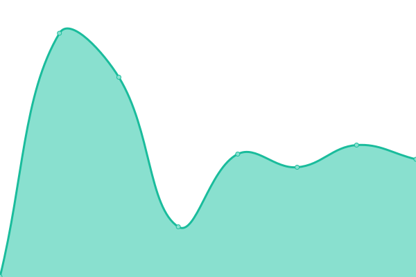
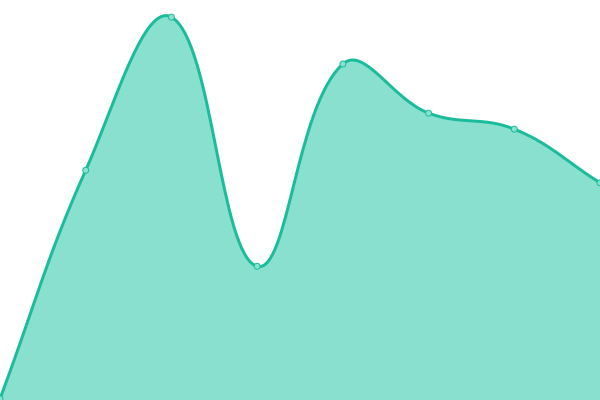
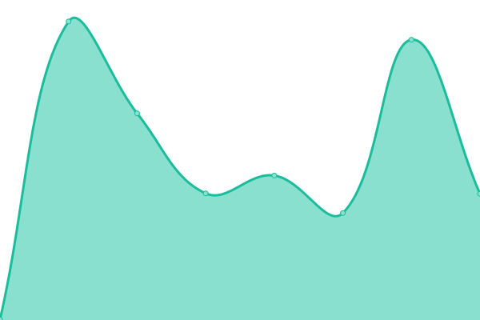
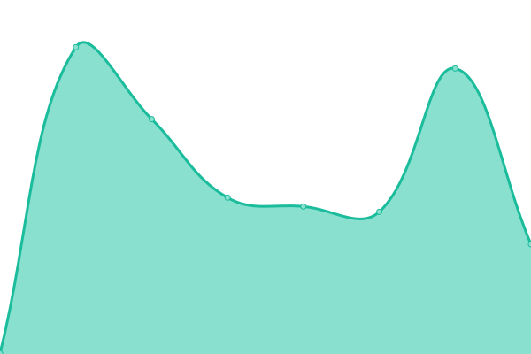
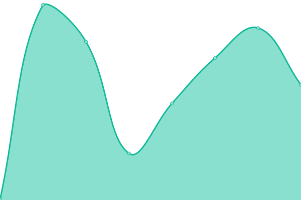

# [📈 Live Status](https://up.p-rimes.net): <!--live status--> **🟧 Partial outage**

This repository contains the open-source uptime monitor and status page for [Paul Reimer](https://www.p-rimes.net), powered by [Upptime](https://github.com/upptime/upptime).

With [Upptime](https://upptime.js.org), you can get your own unlimited and free uptime monitor and status page, powered entirely by a GitHub repository. We use [Issues](https://github.com/paulreimer/up.p-rimes.net/issues) as incident reports, [Actions](https://github.com/paulreimer/up.p-rimes.net/actions) as uptime monitors, and [Pages](https://up.p-rimes.net) for the status page.

<!--start: status pages-->
<!-- This summary is generated by Upptime (https://github.com/upptime/upptime) -->
<!-- Do not edit this manually, your changes will be overwritten -->
<!-- prettier-ignore -->
| URL | Status | History | Response Time | Uptime |
| --- | ------ | ------- | ------------- | ------ |
|  [cdn.p-rimes.net](https://cdn.p-rimes.net/blank.gif) | 🟩 Up | [cdn-p-rimes-net.yml](https://github.com/paulreimer/up.p-rimes.net/commits/HEAD/history/cdn-p-rimes-net.yml) | 

 426ms
     
 | 

<a href="https://up.p-rimes.net/history/cdn-p-rimes-net">100.00%</a>
    

|  [dotfiles.p-rimes.net](https://dotfiles.p-rimes.net/) | 🟩 Up | [dotfiles-p-rimes-net.yml](https://github.com/paulreimer/up.p-rimes.net/commits/HEAD/history/dotfiles-p-rimes-net.yml) | 

 297ms
     
 | 

<a href="https://up.p-rimes.net/history/dotfiles-p-rimes-net">100.00%</a>
    

|  [research-in-progress.com](https://research-in-progress.com/) | 🟥 Down | [research-in-progress-com.yml](https://github.com/paulreimer/up.p-rimes.net/commits/HEAD/history/research-in-progress-com.yml) | 

 0ms
     
 | 

<a href="https://up.p-rimes.net/history/research-in-progress-com">0.00%</a>
    

|  [resume.p-rimes.net](https://resume.p-rimes.net/) | 🟩 Up | [resume-p-rimes-net.yml](https://github.com/paulreimer/up.p-rimes.net/commits/HEAD/history/resume-p-rimes-net.yml) | 

 243ms
     
 | 

<a href="https://up.p-rimes.net/history/resume-p-rimes-net">100.00%</a>
    

|  [spriteworks.ca](https://spriteworks.ca/) | 🟩 Up | [spriteworks-ca.yml](https://github.com/paulreimer/up.p-rimes.net/commits/HEAD/history/spriteworks-ca.yml) | 

 189ms
     
 | 

<a href="https://up.p-rimes.net/history/spriteworks-ca">100.00%</a>
    

|  [vistaplace.ca](https://vistaplace.ca/strata) | 🟩 Up | [vistaplace-ca.yml](https://github.com/paulreimer/up.p-rimes.net/commits/HEAD/history/vistaplace-ca.yml) | 

 445ms
     
 | 

<a href="https://up.p-rimes.net/history/vistaplace-ca">100.00%</a>
    

|  [www.p-rimes.net](https://www.p-rimes.net) | 🟩 Up | [www-p-rimes-net.yml](https://github.com/paulreimer/up.p-rimes.net/commits/HEAD/history/www-p-rimes-net.yml) | 

 472ms
     
 | 

<a href="https://up.p-rimes.net/history/www-p-rimes-net">100.00%</a>
    

|  [matrix.p-rimes.net](https://matrix.p-rimes.net/_dendrite/monitor/health) | 🟥 Down | [matrix-p-rimes-net.yml](https://github.com/paulreimer/up.p-rimes.net/commits/HEAD/history/matrix-p-rimes-net.yml) | 

 0ms
     
 | 

<a href="https://up.p-rimes.net/history/matrix-p-rimes-net">0.00%</a>
    

|  [Polymer_B](https://yll91woz04.execute-api.us-west-2.amazonaws.com/polymer_b/5) | 🟥 Down | [polymer-b.yml](https://github.com/paulreimer/up.p-rimes.net/commits/HEAD/history/polymer-b.yml) | 

 734ms
     
 | 

<a href="https://up.p-rimes.net/history/polymer-b">0.00%</a>
    

|  [Polymer_C](https://yll91woz04.execute-api.us-west-2.amazonaws.com/polymer_c/5) | 🟩 Up | [polymer-c.yml](https://github.com/paulreimer/up.p-rimes.net/commits/HEAD/history/polymer-c.yml) | 

 1604ms
     
 | 

<a href="https://up.p-rimes.net/history/polymer-c">100.00%</a>
    

|  [tcp://logs.p-rimes.net:50002](logs.p-rimes.net) | 🟥 Down | [tcp-logs-p-rimes-net-50002.yml](https://github.com/paulreimer/up.p-rimes.net/commits/HEAD/history/tcp-logs-p-rimes-net-50002.yml) | 

 0ms
     
 | 

<a href="https://up.p-rimes.net/history/tcp-logs-p-rimes-net-50002">0.00%</a>
    

|  [tcp://router.p-rimes.net:22](router.p-rimes.net) | 🟥 Down | [tcp-router-p-rimes-net-22.yml](https://github.com/paulreimer/up.p-rimes.net/commits/HEAD/history/tcp-router-p-rimes-net-22.yml) | 

 0ms
     
 | 

<a href="https://up.p-rimes.net/history/tcp-router-p-rimes-net-22">0.00%</a>
    

<!--end: status pages-->

[**Visit our status website →**](https://up.p-rimes.net)

## 📄 License

- Powered by: [Upptime](https://github.com/upptime/upptime)
- Code: [MIT](./LICENSE) © [Anand Chowdhary](https://anandchowdhary.com), supported by [Pabio](https://pabio.com)
- Data in the `./history` directory: [Open Database License](https://opendatacommons.org/licenses/odbl/1-0/)
